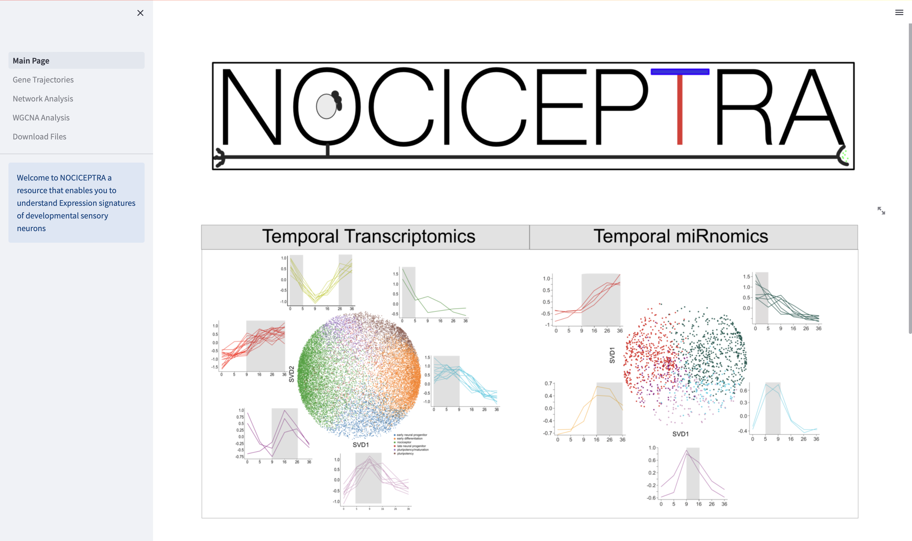
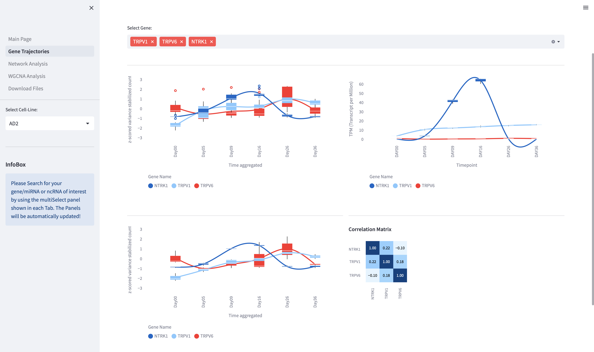

<h2>NOCICEPTRA_Tool</h2>

Beta Version:

Tool in Python that should visualize the Analysis of miRNAs, mRNAs, ncRNAs.

<br>
Data is provided using the DuckDB OLAP Database.
Tool was updated to use interactive libraries instead of Matplotlib such as Altair and Plotly
In addition also further updates were made on the underlying data structure. Now all data is stored in the duckdb database. Which can be downloaded here on github.


<p> Tool can be started using
```
streamlit run Main_page.py
```
<p> There are three different sections: </p>

<ul>
  <li> Gene, ncRNA, miRNA Trajectory Analysis  <br>
  </li>
  <li> WGCNA Analysis </li>
  <li> Network Analysis </li>

</ul>

This app will also be made available at the streamlit cloud server under nociceptra.streamlitapps.io

All the analysis and streamlit dashboar development was performed by Maximilian Zeidler PhD

